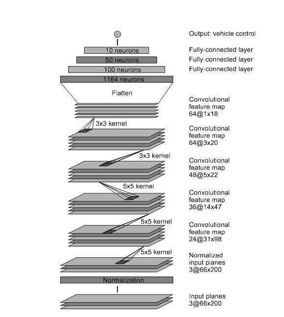

# **Behavioral Cloning** 

[//]: # (Image References)

[image1]: ../NVidia_Network.png "Grayscale"
---

**Behavioral Cloning Project**

The goals / steps of this project are the following:
* Use the simulator to collect data of good driving behavior
* Build, a convolution neural network in Keras that predicts steering angles from images
* Train and validate the model with a training and validation set
* Test that the model successfully drives around track one without leaving the road
* Summarize the results with a written report


## Rubric Points
### Here I will consider the [rubric points](https://review.udacity.com/#!/rubrics/432/view) individually and describe how I addressed each point in my implementation.  

---
### Files Submitted & Code Quality

#### 1. Submission includes all required files and can be used to run the simulator in autonomous mode

My project includes the following files:
* model.py containing the script to create and train the model
* drive.py for driving the car in autonomous mode
* model.h5 containing a trained convolution neural network 
* writeup_report.md or writeup_report.pdf summarizing the results

#### 2. Submission includes functional code
Using the Udacity provided simulator and my drive.py file, the car can be driven autonomously around the track by executing 
```sh
python drive.py model.h5
```

#### 3. Submission code is usable and readable

The Behavioral_cloning.ipynb file contains the code for training and saving the convolution neural network. The file shows the pipeline I used for training and validating the model, and it contains comments to explain how the code works.

### Model Architecture and Training Strategy

#### 1. An appropriate model architecture has been employed

My model consists of a convolution neural network with 5x5 filter sizes,3x3 filter sizes and depths between 32 and 64. The model includes RELU layers to introduce nonlinearity.(model.py lines 73-77) 

The model includes a Cropping2D layer to trim the image (code line 70), and the data is normalized in the model using a Keras lambda layer (code line 72). 

#### 2. Attempts to reduce overfitting in the model
 
The model was trained and validated on different data sets to ensure that the model was not overfitting (code line 61). The model was tested by running it through the simulator and ensuring that the vehicle could stay on the track.

#### 3. Model parameter tuning

The model used an adam optimizer, so the learning rate was not tuned manually (model.py line 84).

#### 4. Appropriate training data

Training data was chosen to keep the vehicle driving on the road. I used a combination of center lane driving, recovering from the left and right sides of the road .

For details about how I created the training data, see the next section. 

### Model Architecture and Training Strategy

#### 1. Solution Design Approach

In this project,I choose to use NVidia Network to clone the behave. The following figure shows the network architecture, which consists of 9 layers, including a normalization layer, 5 convolutional layers, and 3 fully connected layers. The input image is split into YUV planes and passed to the network.



The first layer of the network performs image normalization. The normalizer is hard-coded and is not adjusted in the learning process. Performing normalization in the network allows the normalization scheme to be altered with the network architecture, and to be accelerated via GPU processing.

The convolutional layers are designed to perform feature extraction, and are chosen empirically through a series of experiments that vary layer configurations. We then use strided convolutions in the first three convolutional layers with a 2×2 stride and a 5×5 kernel, and a non-strided convolution with a 3×3 kernel size in the final two convolutional layers.

We follow the five convolutional layers with three fully connected layers, leading to a final output control value which is the inverse-turning-radius. The fully connected layers are designed to function as a controller for steering, but we noted that by training the system end-to-end, it is not possible to make a clean break between which parts of the network function primarily as feature extractor, and which serve as controller.


#### 3. Creation of the Training Set & Training Process

After testing in the simulator with the model trained on the original data provided by udacity,there were a few spots where the vehicle fell off the track.

To capture good driving behavior, I first recorded two laps on track one using center lane driving. Here is an example image of center lane driving:


I then recorded the vehicle recovering from the left side and right sides of the road back to center so that the vehicle would learn to recover from the sides. 

The images from side cameras were used to improve the input data.Here is two example images from side cameras:

Left side camera image


Right side camera image


To augment the dataset, 
I also flipped images and angles which is over 0.05 .

For example, here is an image that has then been flipped:


After the collection process, I had 53109 number of data points. 

I finally randomly shuffled the data set and put 20% of the data into a validation set. 

I used this training data for training the model. The validation set helped determine if the model was over or under fitting. The ideal number of epochs was 8 as evidenced by practice. I used an adam optimizer so that manually training the learning rate wasn't necessary.
